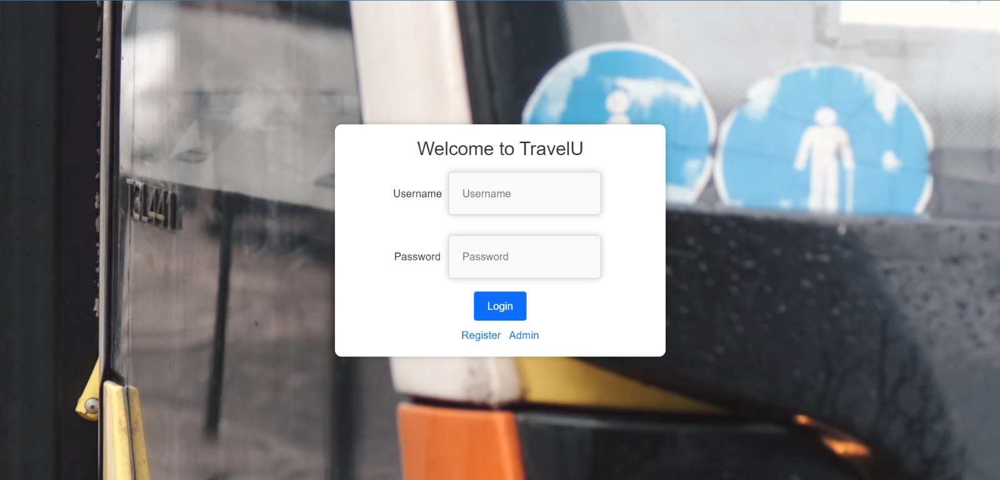
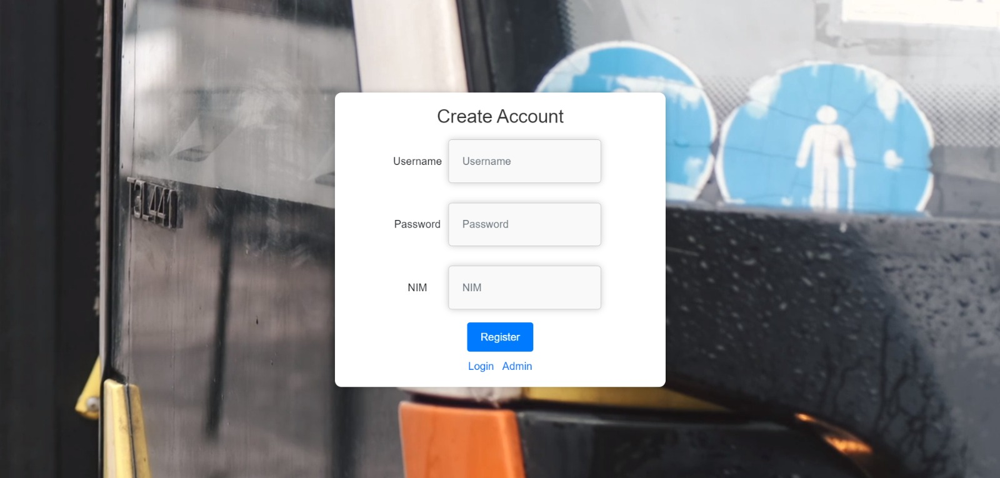
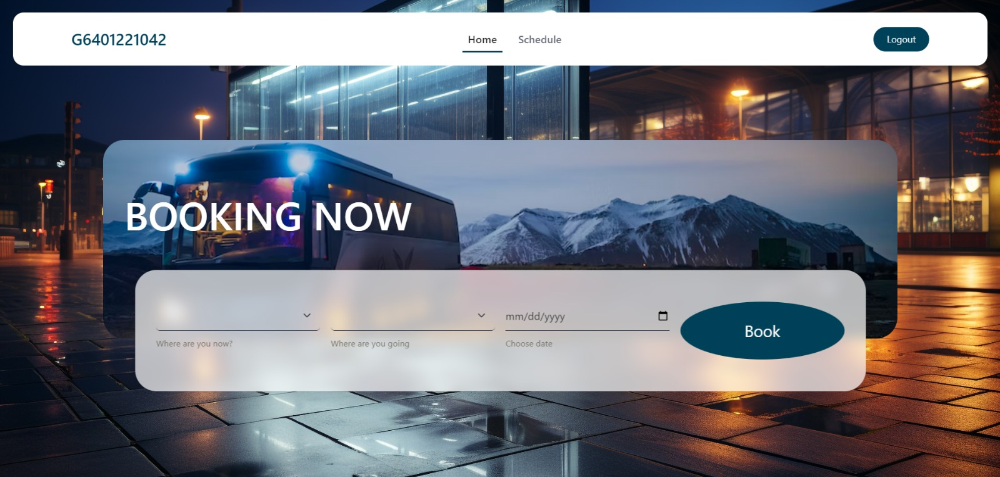
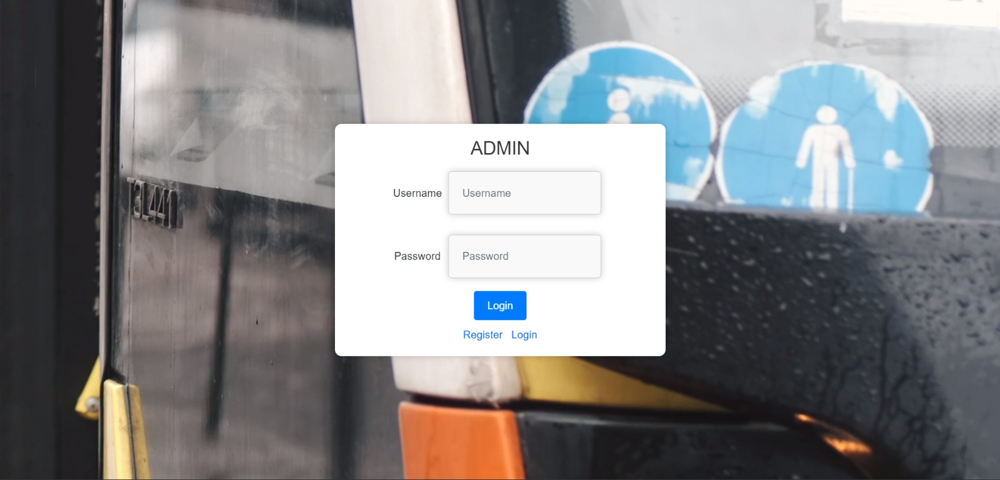
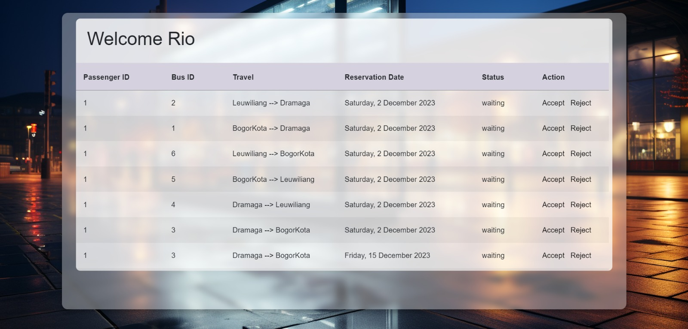

# Project-Akhir-KEL9

### Daftar Isi

- [Deskripsi](#deskripsi)
- [Anggota Kelompok](#anggota-kelompok)
- [Screenshots](#screenshot)
- [Doumentasi Kode](#Dokumentasi-Kode-dan-SQL)
- [Laporan](#Link-Laporan)

## Deskripsi 

## Bahasa Pemrograman
- HTML
- CSS
- Django

## Anggota Kelompok
| Nama                  | NIM           | Username Github                   |
| :-------------------- | :------------ | :-------------------------------- |
| Muhammad Hafidz Rizki | G6401201046   | https://github.com/hfz34          |
| Noer Hanifah Suganda  | G6401201041   | https://github.com/haniniw        |
| Rio Alvein Hasana     | G6401201042   | https://github.com/alveinr1o      |
| Tubagus Raihan R      | G6401201051   | https://github.com/raihanrizqyansyah|

## Screenshots

<table>
  <tbody>
    <tr>
      <td></td>
      <td></td>
    </tr>
    <tr>    
      <td></td>
      <td></td>
    </tr>
    <tr>
      <td></td>
      <td></td>
    </tr>
    <tr>
      <td></td>
    </tr>
  </tbody>
</table>
